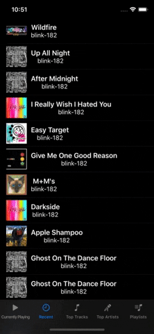

# SociallyMusicService
<a href="https://swift.org">
 
</a>
<a href="https://developer.apple.com/xcode">
  
</a>
<a href="https://swift.org/package-manager">
    
</a>
<a href="https://github.com/OnEdgeInnovation/SociallyMusicService/issues">
   
</a>
<a href="https://opensource.org/licenses/MIT">
  
</a>

## Installation
SociallyMusicService has been configured to work with Swift Package Manager.
In order to add this framework as a dependency: 
- Open your project in Xcode 11.0>=
- Click File>Swift Packages>Add Package Dependency
- Then put in the URL of this repo: https://github.com/OnEdgeInnovation/SociallyMusicService.git
- Configure the versioning as master. Master branch will be the working/tested copy of this repo

## Usage
This API will require you to have previously setup access with the providers beforehand. You will need to head to their respective sites/guides to setup your access tokens. Once you have setup those tokens, you can use them to initialize these services and access the API endpoints I have enabled for you to use.

The services return responses in the form of a SociallyTrack, SociallyArtist, SociallyPlaylist, or APIError. You can check the type of the response to see if it was successful or not. A failure will house an error, and a success will house the response type you are looking for.

Here is some example code:

```swift
let service = SpotifyService()
service.setToken(token: spotifyToken)
service.getPlaylists { (result) in
  switch(result) {
  case .success(let playlists):
    DispatchQueue.main.async {
      self.playlists = playlists
    }
  case .failure(let error):
    print(error)
  }
}
```

You can view an entire demo project [Here.](https://github.com/OnEdgeInnovation/SociallyMusicServiceDemo)



## Spotify Usage
Spotify will require some setup beforehand. Here's some info in regards to their [API.](https://developer.spotify.com/documentation/web-api/)
For just small testing you can request a temporary token from their site (these expire every 60 minutes). If you would like to expand this and allow for user's to sign into your app with their spotify and authorize you to get their tokens, you will need to register your app under their developer site and follow their guidelines.

## Apple Music Usage
Apple Music will also require some setup beforehand. Here's some info in regards to their [API.](https://developer.apple.com/documentation/applemusicapi/)
Their token process is a little bit different. You will get a developer token that you create yourself and can last up to 6 months, and then you will need to create tokens for each individual user while in the app to access personalized requests like getting playlists which more information can be found [here.](https://help.apple.com/developer-account/#/devce5522674)

## License
SociallyMusicService is released under the MIT License.
